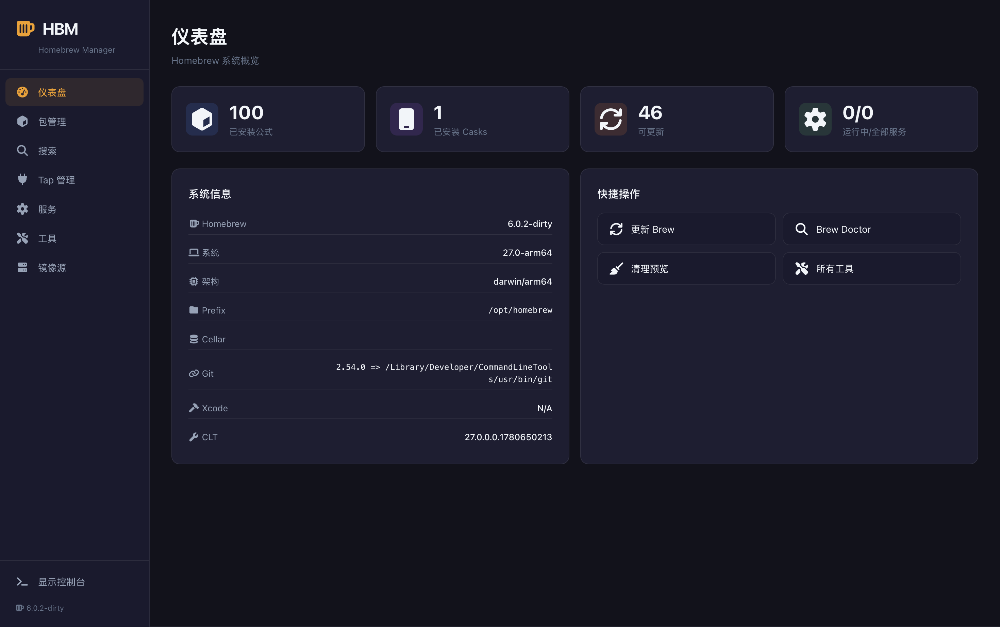
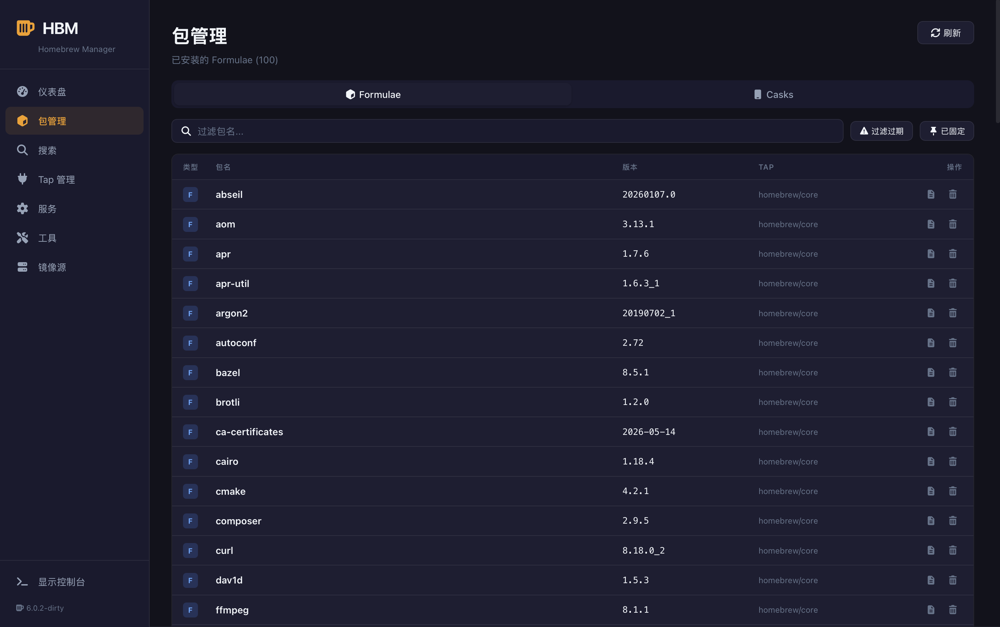
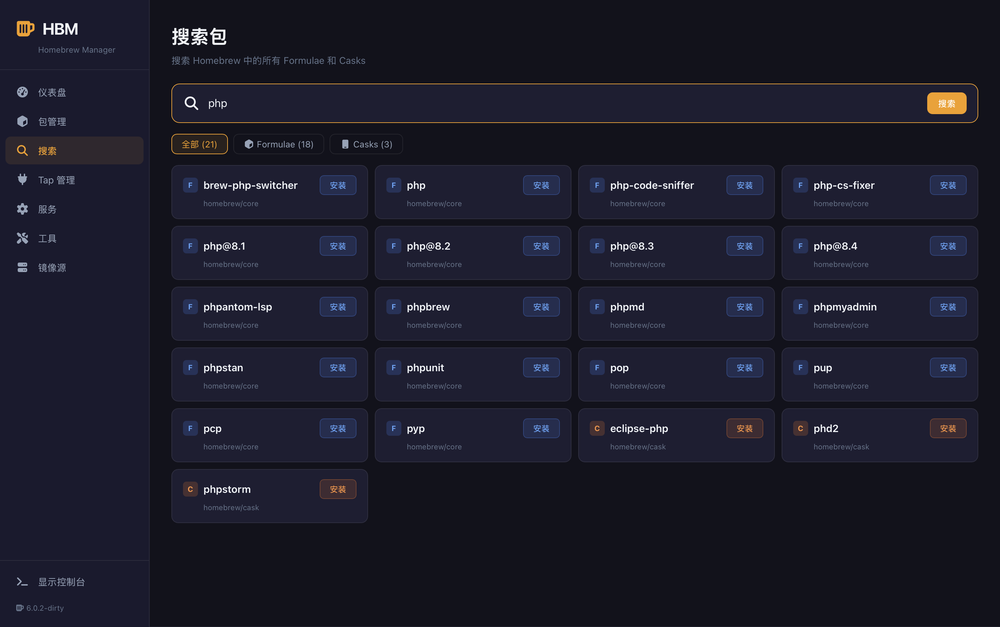
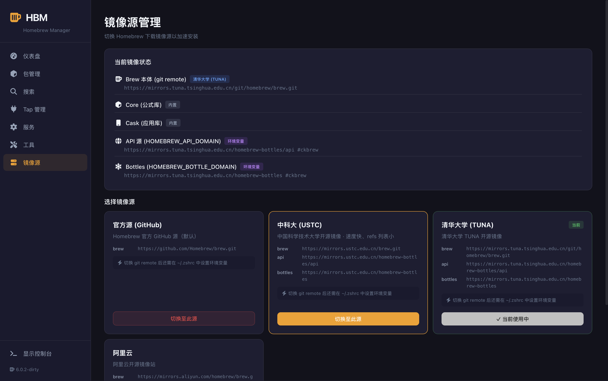
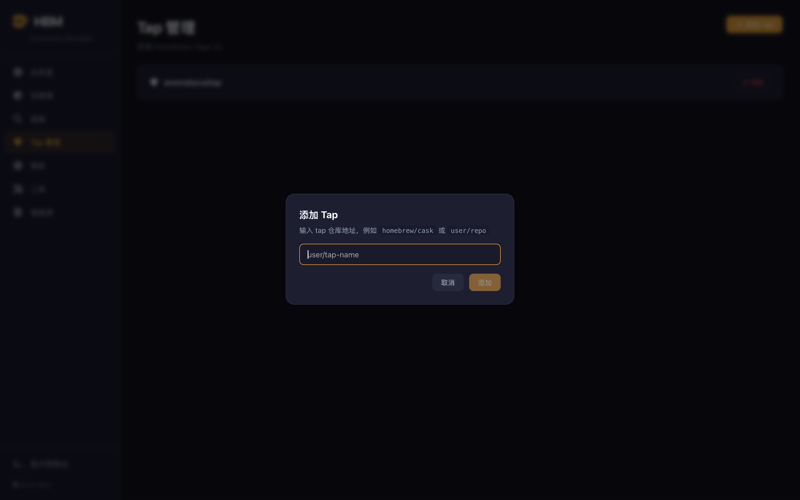
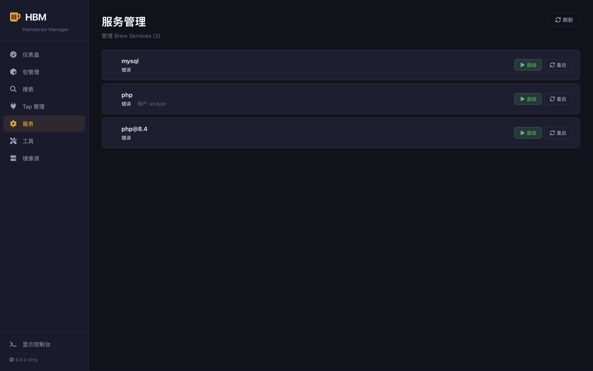
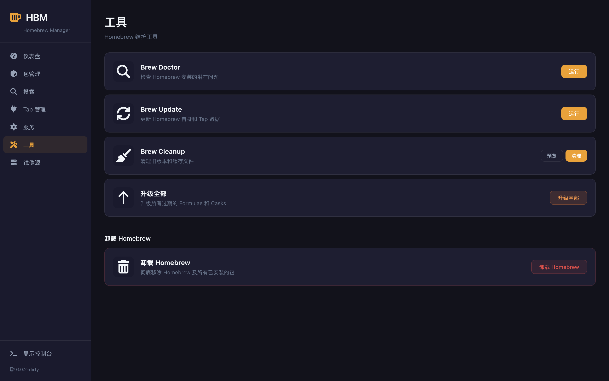

# HBM — Homebrew Manager 🍺

<p align="center">
  <a href="README.md">中文版</a>&nbsp;&nbsp;·&nbsp;&nbsp;<a href="README.en.md">English</a>
</p>

<p align="center">
  &nbsp;&nbsp;&nbsp;&nbsp;
  
</p>

**HBM** is a visual Homebrew management tool built with [Wails](https://wails.io). It covers all core Homebrew CLI features, plus enhanced mirror management and one-click install/uninstall.

## Features

| Feature | Description |
|---------|-------------|
| 📊 **Dashboard** | System overview, package stats, quick actions (brew doctor / update / cleanup) |
| 📦 **Packages** | Browse installed Formulae & Casks, filter, view details, uninstall, upgrade |
| 🔍 **Search** | Search all Homebrew packages, install with one click |
| 🔌 **Taps** | Add/remove Homebrew taps |
| ⚙️ **Services** | Start/stop/restart brew services |
| 🛠️ **Tools** | brew doctor, update, cleanup, upgrade all |
| 🪞 **Mirrors** | One-click switch between official/USTC/Tsinghua/Aliyun mirrors, detect current config |
| 🚀 **Install Wizard** | Auto-detect missing brew, guided one-click install (official/USTC/Tsinghua) |
| 📟 **Live Console** | Real-time streaming output for all operations |

## Screenshots

<table>
  <tr>
    <td></td>
    <td></td>
  </tr>
  <tr>
    <td align="center">📊 Dashboard</td>
    <td align="center">📦 Packages</td>
  </tr>
  <tr>
    <td></td>
    <td></td>
  </tr>
  <tr>
    <td align="center">🔍 Search</td>
    <td align="center">🪞 Mirrors</td>
  </tr>
  <tr>
    <td></td>
    <td></td>
  </tr>
  <tr>
    <td align="center">🔌 Taps</td>
    <td align="center">⚙️ Services</td>
  </tr>
  <tr>
    <td></td>
    <td></td>
  </tr>
  <tr>
    <td align="center">🛠️ Tools</td>
    <td></td>
  </tr>
</table>

## Quick Start

### Prerequisites

- macOS (Apple Silicon / Intel) or Linux
- Go 1.23+
- Node.js 18+

### Development Mode

```bash
# Clone the repo
git clone <repo-url> && cd BrewManager

# Run with live hot-reload
wails dev
```

### Production Build

```bash
# Build as .app bundle
wails build

# Run
open build/bin/HBM.app
```

## Project Structure

```
BrewManager/
├── main.go                 # Wails app entry
├── app.go                  # Go ↔ JS binding layer
├── wails.json              # Wails build config
├── backend/
│   ├── models/types.go     # Shared data types
│   └── brew/
│       ├── executor.go     # Brew command executor (caching + streaming output)
│       ├── packages.go     # Package management (list/search/info/install/uninstall/upgrade)
│       ├── taps.go         # Tap management
│       ├── services.go     # Service management
│       ├── system.go       # System tools (doctor/cleanup/update/stats/install/uninstall)
│       └── mirrors.go      # Mirror management
└── frontend/
    └── src/
        ├── main.ts         # Vue entry
        ├── App.vue         # Main layout
        ├── style.css       # Global styles (dark theme)
        ├── router/         # Route config
        ├── stores/         # Pinia state management
        ├── types/          # TypeScript types
        ├── components/     # Shared components
        │   ├── Sidebar.vue
        │   ├── Console.vue
        │   ├── StatsCard.vue
        │   ├── PackageDetail.vue
        │   └── ConfirmDialog.vue
        └── views/          # Pages
            ├── Dashboard.vue
            ├── Packages.vue
            ├── Search.vue
            ├── Taps.vue
            ├── Services.vue
            ├── Tools.vue
            └── Mirrors.vue
```

## Tech Stack

| Layer | Technology |
|-------|------------|
| **Desktop Framework** | [Wails v2](https://wails.io) |
| **Backend** | Go 1.23 |
| **Frontend** | Vue 3 + TypeScript |
| **Build** | Vite |
| **State Management** | Pinia |
| **Routing** | Vue Router 4 |
| **Icons** | FontAwesome 7 (Free) |
| **Styling** | CSS Variables (dark theme) |

## Mirror Support

HBM supports one-click mirror switching to speed up Homebrew in regions with slow GitHub access:

| Mirror | Brew Repo | API | Bottles |
|--------|-----------|-----|---------|
| Official (GitHub) | `github.com/Homebrew/brew.git` | `formulae.brew.sh` | GitHub |
| USTC (China) | `mirrors.ustc.edu.cn/brew.git` | `mirrors.ustc.edu.cn/.../api` | `mirrors.ustc.edu.cn/.../bottles` |
| Tsinghua (China) | `mirrors.tuna.tsinghua.edu.cn/.../brew.git` | `mirrors.tuna.tsinghua.edu.cn/.../api` | `mirrors.tuna.tsinghua.edu.cn/.../bottles` |
| Aliyun (China) | `mirrors.aliyun.com/homebrew/brew.git` | `mirrors.aliyun.com/.../api` | `mirrors.aliyun.com/.../bottles` |

## Build Instructions

```bash
# Install Wails CLI
go install github.com/wailsapp/wails/v2/cmd/wails@latest

# Development mode (hot reload)
wails dev

# Production build
wails build

# Frontend only (fast debugging)
cd frontend && npm run build
```

## Notes

- **Homebrew 5.0+**: Core/Cask are now built-in JSON API, no separate mirror config needed
- **Dock icon**: Finder icon may need a refresh on first open (`killall Finder`)
- **Environment variables**: Mirror API and Bottles config need to be written to `~/.zshrc` for persistence

## License

MIT
